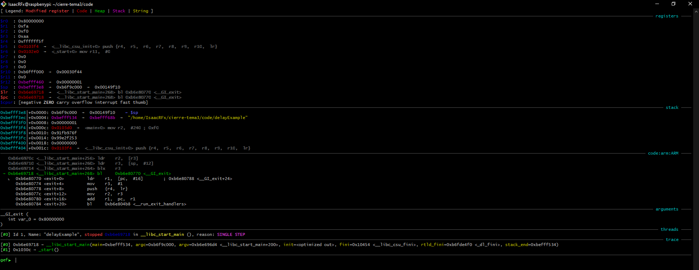
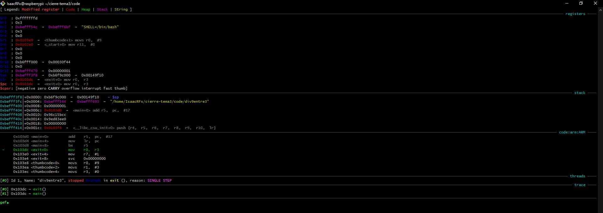
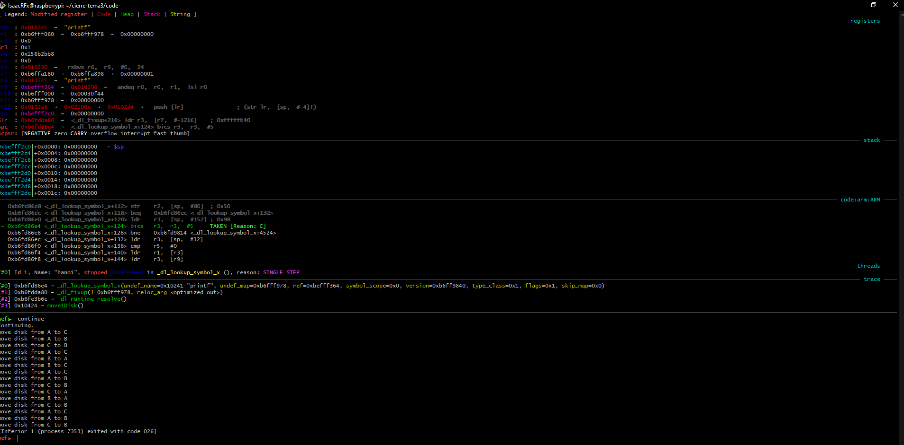
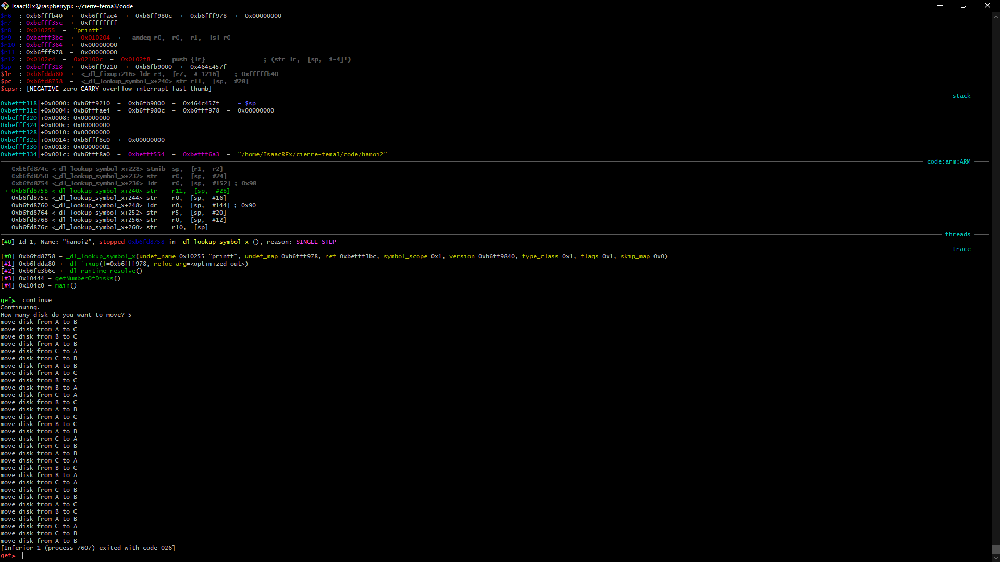
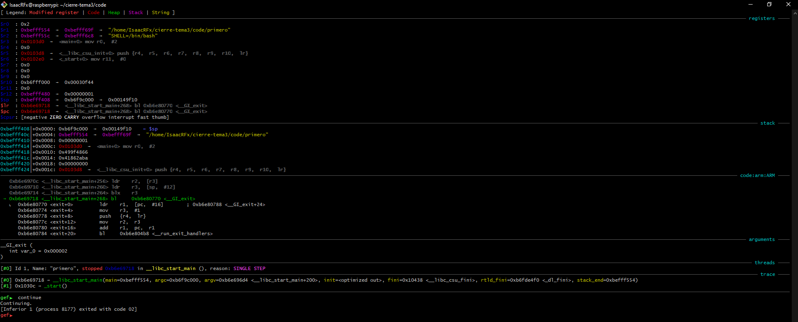
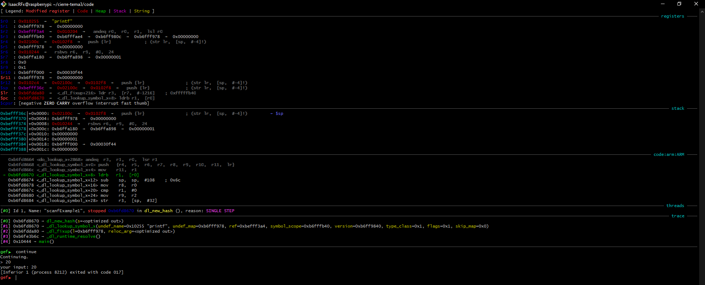
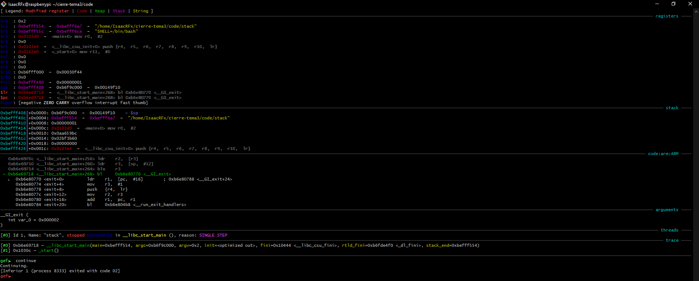
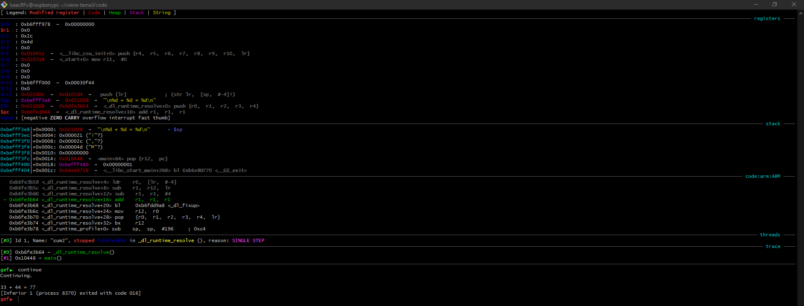
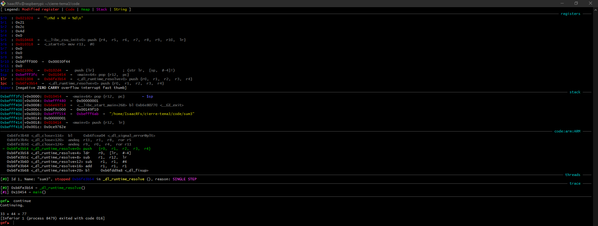
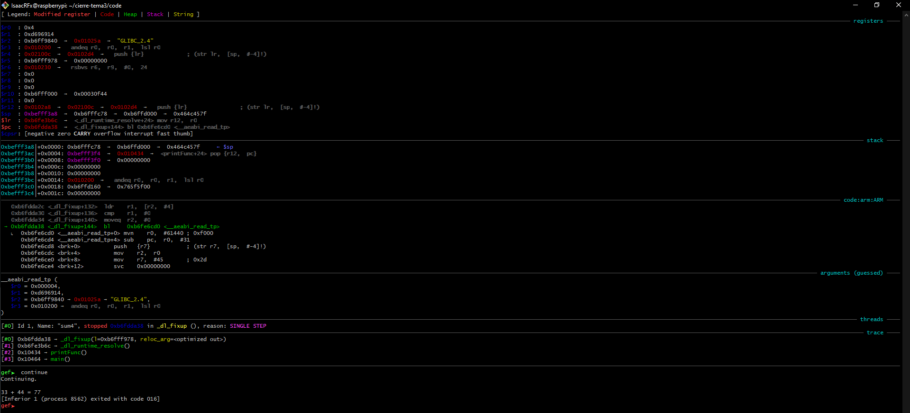

# README


<pre>
<p align=center>
Tecnológico Nacional de México
Instituto Tecnológico de Tijuana

Departamento de Sistemas y Computación
Ingeniería en Sistemas Computacionales

Semestre:
Febrero - Junio 2022

Materia:
Lenguajes de interfaz

Docente:
M.C. Rene Solis Reyes 

Unidad:
3

Título del trabajo:
CIERRE Tema 3: Corra los programas de ARM Assembly entregados a su revisión.

Estudiante:
Rodriguez Flores Edwin Isaac - 19211721
</p>
</pre>
<pre>
<p align=left> 

Repositorio en el cual se demuestra la ejecución de los programas ARM Assembly entregados a su revisión.</p>
</pre>

Se ha utilizado el siguiente makefile para agilizar la ejecución

```make
output: $(file).o
    gcc -o $(file) $(file).o
    gdb $(file)
$(file).o: $(file).s
    as -o $(file).o $(file).s
clean:
    rm *.o
```

## delayExample.s

gdb:



## div9entre3.s

gdb:



## hanoi.s

gdb:



## hanoi2.s

gdb:



## primero.s

gdb:



## scanfExample1.s

gdb:



## stack.s

gdb:



## sum2.s

gdb:



gdb:

## sum3.s

gdb:



## sum4.s

gdb:


